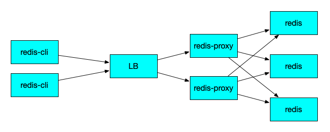
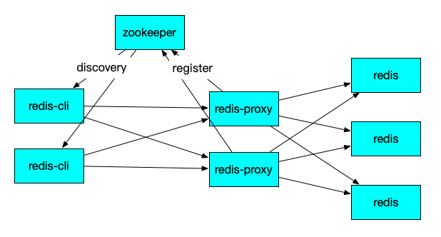
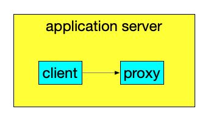

## Deployment and access
In a production environment, at least 2 proxy instances need to be deployed to ensure high availability, and the proxy can be scaled horizontally

## outline
* Deployment mode
* Integrate Zookeeper
* random port
* Elegant on and off line
* Client access (jedis of java)
* Client access (SpringRedisTemplate of java)
* Client access (other languages)
* Precautions (container environment deployment)
* Deployment best practices

### Deployment Mode
Generally speaking, there are two ways to deploy a multi-instance architecture:
* Front four-layer proxy (such as lvs/Ali slb), as follows:
  

At this point, you can call redis proxy just like calling single point redis

* Register the discovery mode (using zk/eureka/consul), as follows:
  

At this point, you need to implement a load balancing strategy on the client side

* In particular, if the application is java, it can also be deployed in the same process, as follows:
  

At this point, the application can directly access 127.0.0.1:6379

### Integrate Zookeeper
camellia provides a default implementation of zookeeper-based registration discovery mode, you can use it like this:
1) First introduce maven dependencies on redis proxy:
````
<dependency>
    <groupId>com.netease.nim</groupId>
    <artifactId>camellia-redis-proxy-zk-registry-spring-boot-starter</artifactId>
    <version>a.b.c</version>
</dependency>
````
2) Add the following configuration to application.yml of redis proxy:
````yaml
server:
  port: 6380
spring:
  application:
    name: camellia-redis-proxy-server

camellia-redis-proxy:
  password: pass123
  transpond:
    type: local
    local:
      resource: redis://@127.0.0.1:6379

camellia-redis-zk-registry:
  enable: true
  zk-url: 127.0.0.1:2181,127.0.0.2:2181
  base-path: /camellia
````
After startup, redis proxy will be registered to zk (127.0.0.1:2181,127.0.0.2:2181)
At this point, you need to get the proxy address list from zk yourself, and then implement the load balancing strategy on the client side yourself, but if your client is java, camellia will help you to do an implementation, refer to the next section

### random port
There are some business scenarios (such as mixed test environment) that are prone to port conflicts. You may want the proxy to support random selection of available ports when it starts up. You can configure it like this
````yaml
server:
  port: 6380
spring:
  application:
    name: camellia-redis-proxy-server

camellia-redis-proxy:
  #port: -6379 #The priority is higher than server.port. If it is missing, server.port will be used. If it is set to -6379, a random available port will be used.
  #application-name: camellia-redis-proxy-server # has higher priority than spring.application.name, if missing, use spring.application.name
  console-port: -16379 #console port, the default is 16379, if it is set to -16379, there will be a random available port
  password: pass123
  transpond:
    type: local
    local:
      resource: redis://@127.0.0.1:6379

camellia-redis-zk-registry:
  enable: true
  zk-url: 127.0.0.1:2181,127.0.0.2:2181
  base-path: /camellia
````
If you set it to special -6379 and -16379, the proxy and the embedded console will randomly select an available port to listen on
You can call the getPort() and getConsolePort() methods of ProxyInfoUtils to get the actual port

### Elegant online and offline
When redis proxy starts, it will start an http server console server at the same time, the default port is 16379
We can use the console server to do some monitoring indicators collection, elegant online and offline operations, etc. The method is to implement a ConsoleService (inherited from ConsoleServiceAdaptor), as shown below:
````java
@Component
public class MyConsoleService extends ConsoleServiceAdaptor implements InitializingBean {

    @Autowired
    private CamelliaRedisProxyBoot redisProxyBoot;

    @Autowired
    private CamelliaRedisProxyZkRegisterBoot zkRegisterBoot;

    @Override
    public ConsoleResult online() {
        zkRegisterBoot.register();
        return super.online();
    }

    @Override
    public ConsoleResult offline() {
        zkRegisterBoot.deregister();
        return super.offline();
    }

    @Override
    public void afterPropertiesSet() throws Exception {
        setServerPort(redisProxyBoot.getPort());
    }
}
````
The console server contains six http apis:
* /online
  Will set a global memory variable status to ONLINE state
* /offline
  Will set a global memory variable status to OFFLINE state
  And if the proxy is idle at this time, it will return http.code=200, otherwise it will return http.code=500
  ps: If and only if the last command has been executed for more than 10s, it will be in idle
* /status
  If status=ONLINE, return http.code=200,
  Otherwise return http.code=500
* /check
  If the server port is reachable (referring to the proxy's service port), return 200, otherwise return 500
* /monitor
  Get monitoring data, see: [Details](../monitor/monitor-data.md)
* /reload
  reload dynamically configure ProxyDynamicConf
* /custom
  A custom interface that can represent different request types by setting different http parameters

In the above example, MyConsoleService injects CamelliaRedisProxyZkRegisterBoot,
If we call /online, CamelliaRedisProxyZkRegisterBoot will be registered to zk (it will be automatically registered after startup; in addition, don't worry about repeated registration, it will be handled internally)
If we call /offline, CamelliaRedisProxyZkRegisterBoot will be removed from zk, because if the proxy has no idle, offline will return 500, so we can call offline repeatedly until it returns 200, at which point we can shutdown the proxy without worrying about the command being executed. was interrupted

### Client access (jedis of java)
If the client side is Java and Jedis is used, then camellia provides RedisProxyJedisPool to facilitate your transformation.
First, add the following maven dependencies to the client-side project (if it is jedis3, introduce camellia-redis-proxy-discovery-jedis3):
````
<dependency>
    <groupId>com.netease.nim</groupId>
    <artifactId>camellia-redis-proxy-discovery-zk</artifactId>
    <version>a.b.c</version>
</dependency>
<dependency>
    <groupId>com.netease.nim</groupId>
    <artifactId>camellia-redis-proxy-discovery-jedis2</artifactId>
    <version>a.b.c</version>
</dependency>
````
Then you can use RedisProxyJedisPool instead of the JedisPool you used originally, and the other operations are the same.
RedisProxyJedisPool uses IProxySelector to define the proxy's load balancing strategy. By default, RandomProxySelector is used, that is, the proxy is randomly selected.
If sideCarFirst=true is set, SideCarFirstProxySelector will be used. Under this strategy, the proxy deployed on the same machine (ie side-car-proxy) will be preferentially selected.
For other proxies, SideCarFirstProxySelector will also preferentially access the proxies of the same region (thereby having a smaller delay), but it needs to implement the RegionResolver interface. By default, the IpSegmentRegionResolver that sets the region according to the ip segment is provided.
Of course, you can also implement IProxySelector yourself to customize the proxy's load balancing strategy
In addition, if redis-proxy uses camellia-dashboard and uses dynamic multi-group configuration, then RedisProxyJedisPool needs to declare its own bid and bgroup
Below is an example:
````java

public class TestRedisProxyJedisPool {

    public static void main(String[] args) {
        String zkUrl = "127.0.0.1:2181,127.0.0.2:2181";
        String basePath = "/camellia";
        String applicationName = "camellia-redis-proxy-server";
        ZkProxyDiscovery zkProxyDiscovery = new ZkProxyDiscovery(zkUrl, basePath, applicationName);

        RedisProxyJedisPool jedisPool = new RedisProxyJedisPool.Builder()
                .poolConfig(new JedisPoolConfig())
// .bid(1)
// .bgroup("default")
                .proxyDiscovery(zkProxyDiscovery)
                .password("pass123")
                .timeout(2000)
                .sideCarFirst(true)
                .regionResolver(new RegionResolver.IpSegmentRegionResolver("10.189.0.0/20:region1,10.189.208.0/21:region2", "default"))
// .proxySelector(new CustomProxySelector())
                .build();

        Jedis jedis = null;
        try {
            jedis = jedisPool.getResource();
            jedis.setex("k1", 10, "v1");
        } finally {
            if (jedis != null) {
                jedis.close();
            }
        }
    }
}

````
All parameters of RedisProxyJedisPool.Builder and their introduction are as follows:
````
    public static class Builder {

        private long bid = -1;//Business id, less than or equal to 0 means not specified
        private String bgroup = null;//Business grouping
        private IProxyDiscovery proxyDiscovery;//proxy discovery, used to get the proxy list and get the change notification of the proxy, the zk-based implementation is provided by default, you can also implement it yourself
        private GenericObjectPoolConfig poolConfig = new JedisPoolConfig();//jedis pool config
        private int timeout = defaultTimeout;//timeout
        private String password;//Password
        private int refreshSeconds = defaultRefreshSeconds;//The interval for refreshing the proxy list from proxyDiscovery
        private int maxRetry = defaultMaxRetry;//Number of retries when getting jedis
        //Because each proxy needs to initialize a JedisPool, when the number of proxies is large, it may cause the initialization of RedisProxyJedisPool to be very slow
        //If jedisPoolLazyInit is enabled, jedisPoolInitialSize proxies will be initialized first according to the proxySelector policy, and the remaining proxies will be initialized lazily, thus speeding up the initialization process of RedisProxyJedisPool
        private boolean jedisPoolLazyInit = defaultJedisPoolLazyInit;//Whether jedisPool needs to be initialized lazily, the default is true, if it is lazily initialized, a small amount of jedisPool corresponding to the proxy will be initialized at first, and then the bottom thread will initialize the jedisPool corresponding to the remaining proxy
        private int jedisPoolInitialSize = defaultJedisPoolInitialSize;//When delaying initialization of jedisPool, the number of proxies initialized at the beginning, the default is 16
        //The following parameters are used to set the proxy selection strategy
        //When proxySelector is explicitly specified
        //-- then use a custom proxy selection strategy
        //If there is no display specification:
        //--When the following parameters are not set, the proxy will be randomly selected from all proxies to initiate the request. At this time, the actual proxySelector used is RandomProxySelector
        //--When sideCarFirst=true is set, the proxy deployed on the same machine will be used first, namely side-car-proxy, and the actual proxySelector used at this time is SideCarFirstProxySelector
        //--localhost is used to determine whether the proxy is a side-car-proxy. If this parameter is missing, the local ip will be automatically obtained
        //--When sideCarFirst=true is set, but side-car-proxy cannot be found, SideCarFirstProxySelector will give priority to using the proxy in the same region, and the method used to determine which region the proxy belongs to is RegionResolver
        //-----When regionResolver is not set, DummyRegionResolver is used by default, that is, all proxies are considered to belong to the same proxy
        //-----We also provide an implementation of IpSegmentRegionResolver, which uses ip segments to divide proxy regions. Of course, you can also implement a custom RegionResolver
        private boolean sideCarFirst = defaultSideCarFirst;
        private String localhost = defaultLocalHost;
        private RegionResolver regionResolver;
        private IProxySelector proxySelector;
````

### Client access (SpringRedisTemplate of java)
If you use Spring's RedisTemplate, in order to access redis-proxy in the way of zk registry, you can introduce the following dependencies:
````
<dependency>
    <groupId>com.netease.nim</groupId>
    <artifactId>camellia-spring-redis-zk-discovery-spring-boot-starter</artifactId>
    <version>a.b.c</version>
</dependency>
````
And add the following dependencies to application.yml (similarly, if redis-proxy uses camellia-dashboard and uses dynamic multi-group configuration, you need to declare bid and bgroup):
````yaml
camellia-spring-redis-zk-discovery:
  application-name: camellia-redis-proxy-server
  #bid: 1
  #bgroup: default
  password: pass123
  zk-conf:
    zk-url: 127.0.0.1:2181
    base-path: /camellia
    side-car-first: true
    region-resolve-conf: 10.189.0.0/20:region1,10.189.208.0/21:region2
    default-region: default
  redis-conf:
    min-idle: 0
    max-active: 8
    max-idle: 8
    max-wait-millis: 2000
    timeout: 2000
````
Then the automatically generated SpringRedisTemplate is to access redis-proxy
See the above example code: [Example](/)

### Client access (other languages)
* If the proxy uses a front-end four-layer proxy to form a cluster, then you can use the standard redis client sdk of the respective language, and then access the proxy cluster like a single-node redis
* If the proxy uses the registration center mode such as zookeeper to form a cluster, you need to implement a set of logic to obtain the addresses of all proxy nodes from the registration center, and implement the desired load balancing strategy, and when the proxy node goes online and offline , you need to handle the change notifications from the registry yourself; in addition, for each proxy node, you can access it like a single-node redis

### Notes (container environment deployment)
When camellia-redis-proxy starts, it will read the number of cpu cores of the operating system by default, and start the corresponding number of work threads
If deployed in a container, be sure to use a higher version of jdk (after jdk8u191), and add -XX:+UseContainerSupport to the startup parameters to ensure that the proxy can automatically obtain the correct number of available cpu cores

If the jdk version does not support the above startup parameters, be sure to set a reasonable number of workThreads (do not exceed the number of available cpu cores), as follows:
````yaml
camellia-redis-proxy:
  password: pass123
  netty:
    boss-thread: 1 #The default is 1
    work-thread: 4 #It is recommended to be equal to the number of available cpu cores, and must not exceed the number of available cpu cores
  transpond:
    type: local
    local:
      type: simple
      resource: redis-cluster://@127.0.0.1:6379,127.0.0.1:6378,127.0.0.1:6377
````

### Deployment Best Practices
* Yunxin online proxy cluster, use 4C8G cloud host or container for deployment (jdk version 1.8.0_202), configure 3G heap memory, with G1 garbage collector
````
-server -Xms3072m, -Xmx3072m -XX:MetaspaceSize=128m -XX:+UseG1GC -verbose:gc -XX:+PrintGCDateStamps -XX:+PrintGCDetails -Xloggc:/xxx/logs/camellia-redis-proxy-gc-`date +%Y-%m-%d_%I-%M-%S`.log
````
* If you have optimization suggestions, or best practices in other environments or machine configurations, welcome to add