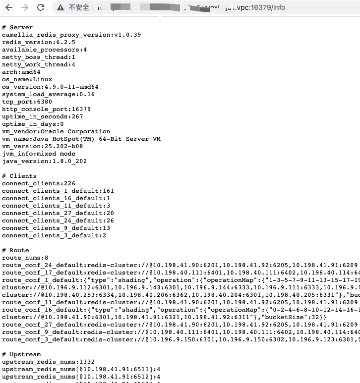
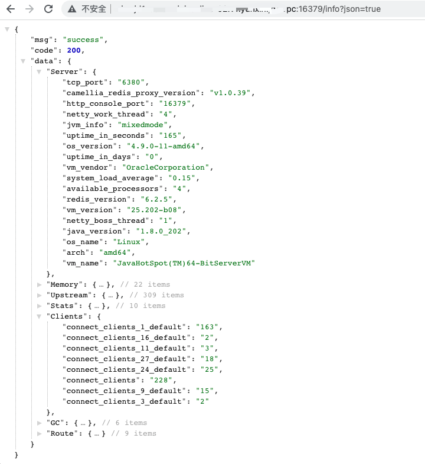
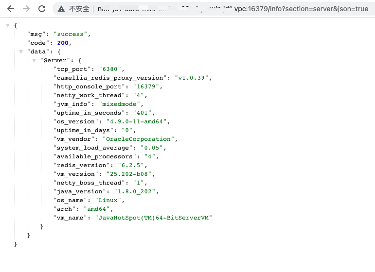
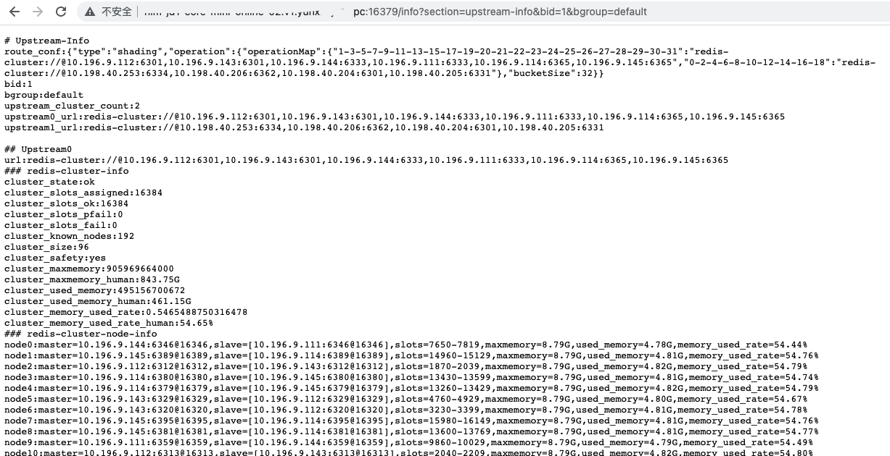
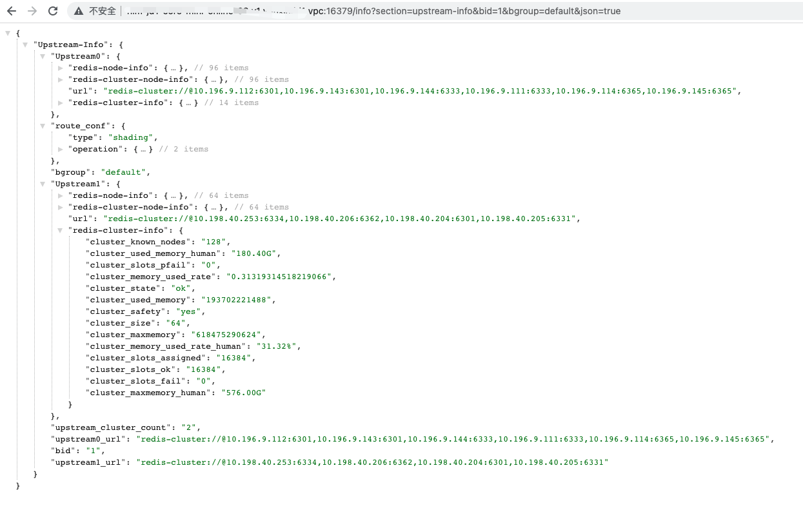

## info command to get related information example
The proxy implements the info command and supports the return of the following information: Server/Clients/Route/Upstream/Memory/GC/Stats/Upstream-Info, meaning respectively:
* Server represents server information, including proxy version, proxy port, operating system type and version, virtual machine version, java version, etc.
* Clients will return the number of client connections connected to the proxy
* Route routing information, including routing configuration number and routing configuration
* Upstream backend redis connections
* Memory memory
* GC garbage collection related information
* Stats statistics (number of requests, QPS, etc.)
* Upstream-Info Information of the back-end redis cluster, including the memory usage, version, master-slave distribution, slot distribution, etc. of the back-end redis

You can enter info directly, and all information except Upstream-Info will be returned, as follows:
````
127.0.0.1:6380>info
# Server
camellia_redis_proxy_version:v1.1.1 ##proxy version
redis_version:6.2.5 ##spring actuator will use the redis_version field returned by the info command to perform health checks by default, and a fixed version number is returned directly here
available_processors:4 ##cpu cores
netty_boss_thread:1 ##Number of threads of netty's bossGroup, default=1
netty_work_thread:4 ##netty number of worker threads, default = number of cpu cores
arch:amd64 ##System architecture
os_name:Linux ##Operating system name
os_version:4.9.0-3-amd64 ##OS version
system_load_average:0.22 ##System load
tcp_port:6380 ##proxy service port
http_console_port:16379 ##proxy's console port
uptime_in_seconds:295 ##proxy startup time (seconds)
uptime_in_days:0 ##proxy startup time (days)
vm_vendor:Oracle Corporation ##Virtual machine vendor
vm_name:Java HotSpot(TM) 64-Bit Server VM ##Virtual machine name
vm_version:25.202-b08 ##Virtual machine version
jvm_info:mixed mode ##Virtual machine info
java_version:1.8.0_202 ##java version

# Clients
connect_clients:14 ##Number of client connections
connect_clients_1_default:10 ##bid=1, the number of client connections for bgroup=default
connect_clients_2_default:4 ##bid=2, the number of client connections of bgroup=default

# Route
route_nums:6 ##Route configuration number
route_conf_20_default:redis://***********@10.201.48.171:6379 ##Route configuration, indicating the configuration of bid=1 and bgroup=default
route_conf_1_default:redis-cluster://@10.177.0.64:8801,10.177.0.64:8802,10.177.0.65:8803,10.177.0.65:8804,10.177.0.66:8805,10.177.0.66:8806
route_conf_11_default:redis://***********@10.201.48.171:6379
route_conf_27_default:redis://***********@10.201.48.171:6379
route_conf_9_default:redis://***********@10.201.48.171:6379
route_conf_3_default:{"type":"simple","operation":{"read":"redis-cluster://@10.177.0.64:8801,10.177.0.64:8802,10.177.0.65:8803,10.177.0.65: 8804,10.177.0.66:8805,10.177.0.66:8806","type":"rw_separate","write":{"resources":["redis-cluster://@10.177.0.64:8801,10.177.0.64 :8802,10.177.0.65:8803,10.177.0.65:8804,10.177.0.66:8805,10.177.0.66:8806","redis://***********@10.201.48.171:6379 "],"type":"multi"}}}

#Upstream
upstream_redis_nums:17 ##Number of backend redis connections
upstream_redis_nums[@10.177.0.69:8803]:4 ##The number of backend redis connections, the number of connections for a specific ip:port
upstream_redis_nums[***********@10.201.48.171:6379]:5
upstream_redis_nums[@10.177.0.64:8802]:4
upstream_redis_nums[@10.177.0.64:8801]:4

# Memory ##proxy memory information
free_memory: 309393192
free_memory_human: 295.06M
total_memory: 377487360
total_memory_human: 360.00M
max_memory: 7635730432
max_memory_human: 7.11G
heap_memory_init: 536870912
heap_memory_init_human: 512.00M
heap_memory_used: 68094168
heap_memory_used_human: 64.94M
heap_memory_max: 7635730432
heap_memory_max_human: 7.11G
heap_memory_committed: 377487360
heap_memory_committed_human: 360.00M
non_heap_memory_init: 2555904
non_heap_memory_init_human: 2.44M
non_heap_memory_used: 32339792
non_heap_memory_used_human: 30.84M
non_heap_memory_max: -1
non_heap_memory_max_human: -1B
non_heap_memory_committed: 33882112
non_heap_memory_committed_human: 32.31M

# GC
gc0_name:G1 Young Generation ##GC's collector type
gc0_collection_count:3 ##GC cumulative times
gc0_collection_time:3 ##gc cumulative time
gc1_name: G1 Old Generation
gc1_collection_count:0
gc1_collection_time:0

#Stats
commands_count:4158008 ##Number of requests since proxy startup
read_commands_count:928037 ##Number of read requests since proxy startup
write_commands_count:3229970 ##Number of write requests since proxy startup
avg_commands_qps:34183.18 ##Average QPS since proxy startup
avg_read_commands_qps:7629.44 ##Average read QPS since proxy startup
avg_write_commands_qps:26553.74 ##Average write QPS since proxy startup
monitor_interval_seconds:60 ##Statistical period, in seconds
last_commands_qps: 29304.43 ##Proxy's QPS in the last statistical period
last_read_commands_qps:6426.05 ##Proxy's read QPS for the last statistical period
last_write_commands_qps:22878.38 ##Proxy's write QPS in the last statistical period

````

You can also print only one of them, for example, you only want to see the memory information, as follows (the parameters after info are case-ignoring):
````
127.0.0.1:6380>info memory
# Memory
free_memory: 309393192
free_memory_human: 295.06M
total_memory: 377487360
total_memory_human: 360.00M
max_memory: 7635730432
max_memory_human: 7.11G
heap_memory_init: 536870912
heap_memory_init_human: 512.00M
heap_memory_used: 68094168
heap_memory_used_human: 64.94M
heap_memory_max: 7635730432
heap_memory_max_human: 7.11G
heap_memory_committed: 377487360
heap_memory_committed_human: 360.00M
non_heap_memory_init: 2555904
non_heap_memory_init_human: 2.44M
non_heap_memory_used: 32339792
non_heap_memory_used_human: 30.84M
non_heap_memory_max: -1
non_heap_memory_max_human: -1B
non_heap_memory_committed: 33882112
non_heap_memory_committed_human: 32.31M

````

In particular, Upstream-Info must be specified before it can be returned (the default route is returned at this time), as follows:
````
127.0.0.1:6381>info upstream-info
#Upstream-Info
route_conf:{"type":"sharding","operation":{"operationMap":{"0-2-4":{"read":"redis-sentinel-slaves://@127.0.0.1:26379/ master1?withMaster=true","type":"rw_separate","write":"redis-sentinel://@127.0.0.1:26379/master1"},"1-3-5":"redis-cluster: //@10.189.28.62:7008,10.189.28.60:7001,10.189.28.62:7011"},"bucketSize":6}}
upstream_cluster_count:3 ##Number of redis clusters in this routing backend
upstream0_url:redis-cluster://@10.189.28.62:7008,10.189.28.60:7001,10.189.28.62:7011 ##The redis cluster address 1 contained in this route
upstream1_url:redis-sentinel://@127.0.0.1:26379/master1 ##The redis cluster address 2 contained in this route
upstream2_url:redis-sentinel-slaves://@127.0.0.1:26379/master1?withMaster=true ##Redis cluster address 3 included in this route

## Upstream0 ## Information about a redis cluster contained in this route
url:redis-cluster://@10.189.28.62:7008,10.189.28.60:7001,10.189.28.62:7011 ##Address, this is a redis-cluster
### redis-cluster-info
cluster_state:ok ##Cluster state
cluster_slots_assigned: 16384 ##Number of slots assigned by the cluster
cluster_slots_ok: 16384 ##Number of slots in cluster state ok
cluster_slots_pfail:0 ##Number of slots in pfail state
cluster_slots_fail:0 ##Number of slots in the fail state
cluster_known_nodes:6 ##Number of nodes in the cluster
cluster_size:3 ##Cluster size, that is, the number of master nodes
cluster_safety:yes ##If the master has no slave, or the master node with one ip accounts for more than half of all master nodes, the cluster is considered to be unsafe, refer to: https://redis.io/topics/cluster-spec
cluster_maxmemory:9663676416 ##The total memory size of the cluster
cluster_maxmemory_human:9.00G ##The total memory size of the cluster (readability)
cluster_used_memory:2304452928 ## Cluster used memory size
cluster_used_memory_human: 2.15G ## Cluster used memory size (readability)
cluster_memory_used_rate:0.2384654482205709 ##Cluster memory usage rate
cluster_memory_used_rate_human:23.87% ##Cluster memory usage (percentage)
### redis-cluster-node-info ##Cluster node information (master and slave nodes, slot distribution, memory usage)
node0:master=10.189.28.62:7008@17008,slave=[10.189.28.60:7003@17003],slots=5461-10922,maxmemory=3.00G,used_memory=733.38M,memory_used_rate=23.87%
node1:master=10.189.28.60:7001@17001,slave=[10.189.28.62:7010@17010],slots=10923-16383,maxmemory=3.00G,used_memory=733.38M,memory_used_rate=23.87%
node2:master=10.189.28.62:7011@17011,slave=[10.189.28.62:7009@17009],slots=0-5460,maxmemory=3.00G,used_memory=733.38M,memory_used_rate=23.87%
### redis-node-info
#### node0 ##Node information
master_url=10.189.28.62:7008@17008 ##Node url
redis_version:4.0.9 ##redis version
used_memory:768150976 ##Used memory size
used_memory_human:732.57M ##Used memory size (readability)
maxmemory:3221225472 ##Maximum memory
maxmemory_human:3.00G ##Maximum memory (readability)
memory_used_rate:0.2384654482205709 ##Memory usage
memory_used_rate_human:23.85% ##Memory usage (percentage)
maxmemory_policy:allkeys-lru ##key elimination policy
hz:10 ##hz, increasing its value will take up more cpu, of course the corresponding redis will be faster to process many keys that expire at the same time, and more accurate to handle timeouts
role:master ##Node type
connected_slaves:1 ##Number of slave nodes
slave0:ip=10.189.28.60,port=7003,state=online,offset=88682163709,lag=0 ##Slave node information
key_count:297 #Number of keys
expire_key_count:294 #Number of keys with expiration time
avg_ttl:62496349 #average ttl
qps:20
#### node1
master_url=10.189.28.60:7001@17001
redis_version: 4.0.9
used_memory: 768150976
used_memory_human: 3.77M
maxmemory:3221225472
maxmemory_human: 3.00G
memory_used_rate: 0.2384654482205709
memory_used_rate_human: 23.85%
maxmemory_policy:allkeys-lru
hz:10
role:master
connected_slaves:1
slave0:ip=10.189.28.62,port=7010,state=online,offset=253642106463,lag=0
key_count: 297
expire_key_count: 294
avg_ttl:62496349
qps:20
#### node2
master_url=10.189.28.62:7011@17011
redis_version: 4.0.9
used_memory: 768150976
used_memory_human: 732.05M
maxmemory:3221225472
maxmemory_human: 3.00G
memory_used_rate: 0.2382984757423401
memory_used_rate_human: 23.83%
maxmemory_policy:allkeys-lru
hz:10
role:master
connected_slaves:1
slave0:ip=10.189.28.62,port=7009,state=online,offset=186569832085,lag=1
key_count: 297
expire_key_count: 294
avg_ttl:62496349
qps:20

##Upstream1
url:redis-sentinel://@127.0.0.1:26379/master1
### redis-node-info
master_url:@127.0.0.1:6380
redis_version: 6.0.6
used_memory: 2437680
used_memory_human: 2.32M
maxmemory:3221225472
maxmemory_human: 3.00G
memory_used_rate: 0.23873232305049896
memory_used_rate_human: 23.87%
maxmemory_policy:noeviction
hz:10
role:master
connected_slaves:1
slave0:ip=127.0.0.1,port=6379,state=online,offset=570473,lag=1
key_count: 297
expire_key_count: 294
avg_ttl:62496349
qps:20

##Upstream2
url:redis-sentinel-slaves://@127.0.0.1:26379/master1?withMaster=true
### redis-node-info
master_url:@127.0.0.1:6380
redis_version: 6.0.6
used_memory: 2437680
used_memory_human: 2.32M
maxmemory: 3.00G
maxmemory_human: 3.00G
memory_used_rate: 0.23873232305049896
memory_used_rate_human: 23.87%
maxmemory_policy:noeviction
hz:10
role:master
connected_slaves:1
slave0:ip=127.0.0.1,port=6379,state=online,offset=570473,lag=1
key_count: 297
expire_key_count: 294
avg_ttl:62496349
qps:20

````

In addition, if multiple routes are configured on the proxy, you can specify bid and bgroup to return the backend upstream information of a specific route, as follows (in the example, the backend information of bid=1 and bgroup=default is returned):
````
127.0.0.1:6381> info upstream-info 1 default
#Upstream-Info
route_conf:redis://@127.0.0.1:6379
bid:1
bgroup:default
upstream_cluster_count: 1
upstream0_url:redis://@127.0.0.1:6379

##Upstream0
url:redis://@127.0.0.1:6379
### redis-node-info
redis_version: 6.0.6
used_memory: 2082800
used_memory_human: 1.99M
maxmemory:0
maxmemory_human: 0B
memory_used_rate: 0.0
memory_used_rate_human: 0.00%
maxmemory_policy:noeviction
hz:10
role:master
connected_slaves:0
key_count: 297
expire_key_count: 294
avg_ttl:62496349
qps:20
````

In addition to using the redis protocol to obtain info information, you can also execute and obtain info information based on the console's http-api:
You can visit http://127.0.0.1:16379/info to get information (json format is supported), as follows:

*txt form:



*json format:



You can also use the section parameter as follows:
*txt form:

<imgsrc="redis-proxy-info-api-section-txt.png" width="50%" height="50%">

*json format:



Upstream-info is also supported, as follows:

*txt form:



*json format:

