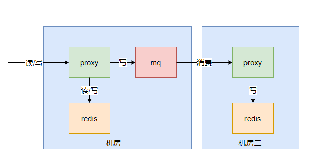
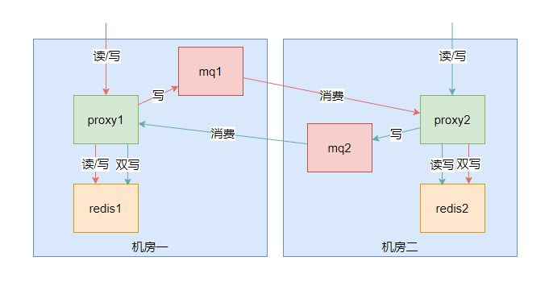

## MqMultiWriteProxyPlugin

### illustrate
* Asynchronous double-write plugin based on mq (currently supports kafka)
* This plugin is not built-in (because kafka-sdk is to be introduced), so it needs to be imported and configured with full class name
* Redis data double-write synchronization across computer rooms or remote computer rooms is required, which can be used for data migration or disaster recovery
* Remark 1: Only the write commands in the command set fully supported by proxy support this mode. For those limited supported commands (such as blocking commands, publish and subscribe commands, etc.), the use of MultiWriteProxyPlugin to double write is not supported.
* Remark 2: When using MultiWriteCommandInterceptor to double write the write command wrapped by the redis transaction, the main route may fail to execute but the double write succeeds.

### Architecture diagram


* kafka includes production and consumption, so it will include 2 ProxyPlugins, namely MqMultiWriteProducerProxyPlugin and KafkaMqPackConsumerProxyPlugin
* The production side will intercept the request and deliver it to kafka
* The consumer simply starts the plugin (the consumer thread will be started internally), and the plugin itself will not intercept any requests

### Import maven dependencies
````
<dependency>
    <groupId>com.netease.nim</groupId>
    <artifactId>camellia-redis-proxy-mq-common</artifactId>
    <version>a.b.c</version>
</dependency>
<dependency>
    <groupId>com.netease.nim</groupId>
    <artifactId>camellia-redis-proxy-mq-kafka</artifactId>
    <version>a.b.c</version>
</dependency>
````

### Enable method (production side)
````yaml
server:
  port: 6380
spring:
  application:
    name: camellia-redis-proxy-server

camellia-redis-proxy:
  console-port: 16379 #console port, the default is 16379, if set to -16379, there will be a random available port, if set to 0, the console will not be started
  password: pass123 #proxy password, if a custom client-auth-provider-class-name is set, the password parameter is invalid
  monitor-enable: true #Whether to enable monitoring
  monitor-interval-seconds: 60 #Monitor callback interval
  plugins: #Use yml to configure plugins, built-in plugins can be enabled directly using aliases, custom plugins need to configure the full class name
    - com.netease.nim.camellia.redis.proxy.mq.common.MqMultiWriteProducerProxyPlugin
  transpond:
    type: local #Use local configuration
    local:
      type: simple
      resource: redis://@127.0.0.1:6379 #Forwarded redis address
````
add configuration
````properties
#The address and topic of kafka on the production side, separated by backslashes
mq.multi.write.producer.kafka.urls=127.0.0.1:9092,127.0.0.1:9093/camellia_multi_write_kafka
#Use KafkaMqPackSender to perform asynchronous writing of mq, you can also implement one to go to other mq by yourself
mq.multi.write.sender.className=com.netease.nim.camellia.redis.proxy.mq.kafka.KafkaMqPackSender
````

### Enable method (consumer side)
````yaml
server:
  port: 6380
spring:
  application:
    name: camellia-redis-proxy-server

camellia-redis-proxy:
  console-port: 16379 #console port, the default is 16379, if set to -16379, there will be a random available port, if set to 0, the console will not be started
  password: pass123 #proxy password, if a custom client-auth-provider-class-name is set, the password parameter is invalid
  monitor-enable: true #Whether to enable monitoring
  monitor-interval-seconds: 60 #Monitor callback interval
  plugins: #Use yml to configure plugins, built-in plugins can be enabled directly using aliases, custom plugins need to configure the full class name
    - com.netease.nim.camellia.redis.proxy.mq.kafka.KafkaMqPackConsumerProxyPlugin
  transpond:
    type: local #Use local configuration
    local:
      type: simple
      resource: redis://@127.0.0.1:6379 #Forwarded redis address
````
add configuration
````properties
#The address and topic of the consumer kafka, separated by backslashes
mq.multi.write.consumer.kafka.urls=127.0.0.1:9092,127.0.0.1:9093/camellia_multi_write_kafka
````

You can also configure both producers and consumers to achieve the following effects:



In addition, if the proxy enables bid/bgroup, the context information will also be synchronized with kafka; the proxy also supports writing/consuming multiple groups of kafka at the same time, as follows:
````
#Production side, vertical line separation can represent multiple groups of kafka and topic
mq.multi.write.producer.kafka.urls=127.0.0.1:9092,127.0.0.1:9093/camellia_multi_write_kafka|127.0.0.2:9092,127.0.0.2:9093/camellia_multi_write_kafka2
#The production side also supports setting different kafka write addresses for different bid/bgroups, as follows: bid=1, bgroup=default write address
1.default.mq.multi.write.producer.kafka.urls=127.0.0.1:9092,127.0.0.1:9093/camellia_multi_write_kafka

#Consumer side, the vertical bar can represent multiple groups of kafka and topic
mq.multi.write.consumer.kafka.urls=127.0.0.1:9092,127.0.0.1:9093/camellia_multi_write_kafka|127.0.0.2:9092,127.0.0.2:9093/camellia_multi_write_kafka2
````


Several other configurable parameters:
* When consuming Kafka's double-write tasks, by default, the consumer will directly send the task to the backend redis (asynchronously). If several consecutive commands belong to the same bid/bgroup, the consumer will deliver them in batches. The default maximum sub-batch is 200, which can be modified by mq.multi.write.commands.max.batch=200
* If you want to retry when the double write is abnormal, you need to enable mq.multi.write.kafka.consumer.sync.enable=true, and then configure the retry through the mq.multi.write.kafka.consume.retry=3 parameter The number of attempts. At this time, if the back-end redis connection is unavailable, the consumer will retry, and the retry interval will increase by 1s/2s/3s/4s/...
* When mq.multi.write.kafka.consumer.sync.enable=true is enabled, in order to support retry, in order to avoid kafka's consumer triggering rebalance, the consumer will use pause/commitSync to manually control the consumption speed, and will use A memory queue is used for buffering. The capacity of the buffer queue can be configured by mq.multi.write.kafka.consume.queue.size=100
* When mq.multi.write.kafka.consumer.sync.enable=true is enabled, because retry is supported, and in order to ensure the order of command execution, all commands are executed in sequence, batches are not supported
* For the meaning of related parameters and other parameters, see the source code KafkaMqPackConsumer.java